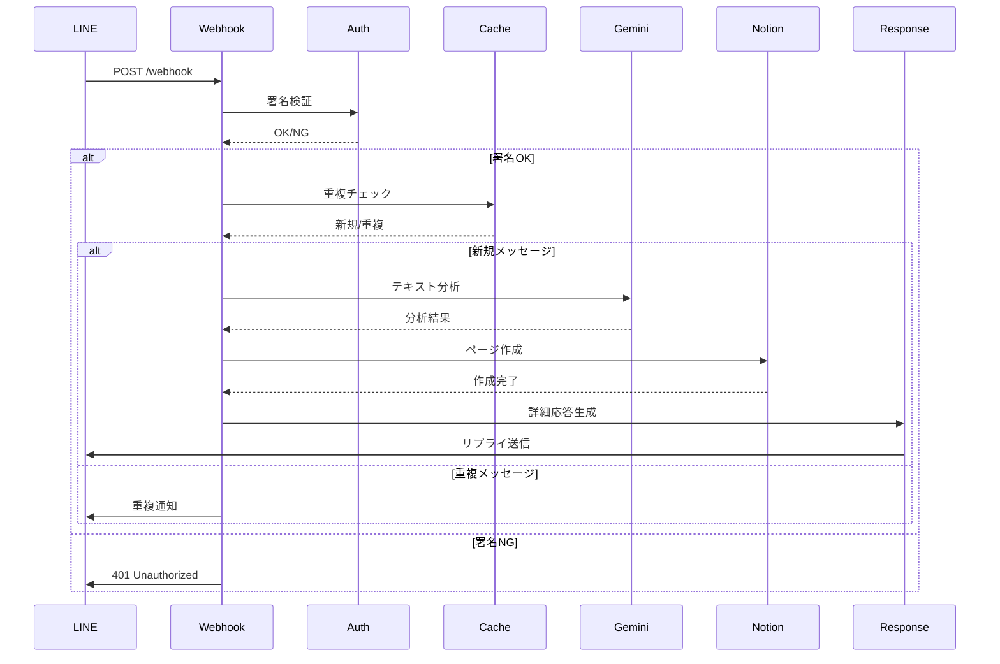
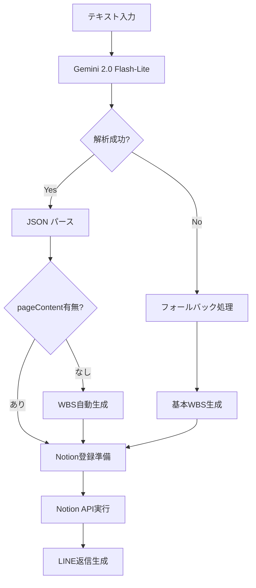

# API仕様書

**line-pm システムの API エンドポイント詳細仕様**

## 📋 概要

line-pmシステムで提供するAPIエンドポイントの詳細仕様です。主にLINE Webhookエンドポイントと管理用エンドポイントを提供しています。

## 🔗 ベースURL

```
Production: https://line-pm-production.up.railway.app
Local:      http://localhost:8080
```

## 📱 エンドポイント一覧

### 1. ヘルスチェック

#### `GET /`

システムの稼働状況を確認するためのエンドポイント。

**リクエスト**:
```http
GET / HTTP/1.1
Host: line-pm-production.up.railway.app
```

**レスポンス**:
```json
{
  "status": "OK",
  "timestamp": "2025-06-12T10:30:00.000Z",
  "environment": "production",
  "services": {
    "projectAnalyzer": true,
    "notionService": true,
    "lineClient": true
  },
  "cache": {
    "processedEvents": 15
  },
  "memory": {
    "used": "45MB",
    "total": "128MB"
  }
}
```

**ステータスコード**:
- `200 OK`: システム正常稼働
- `500 Internal Server Error`: システムエラー

**使用例**:
```bash
# cURLでのヘルスチェック
curl https://line-pm-production.up.railway.app/

# レスポンス確認
{
  "status": "OK",
  "timestamp": "2025-06-12T10:30:00.000Z",
  "services": {
    "projectAnalyzer": true,
    "notionService": true
  }
}
```

### 2. LINE Webhook

#### `POST /webhook`

LINE BotからのWebhookリクエストを処理するメインエンドポイント。

**認証**: LINE署名検証が必要

**ヘッダー**:
```http
Content-Type: application/json
x-line-signature: {LINE署名}
```

**リクエストボディ例**:
```json
{
  "destination": "Uxxxxxxxxxxxxxxxxxxxxxxxxxxxx",
  "events": [
    {
      "type": "message",
      "mode": "active",
      "timestamp": 1640995200000,
      "source": {
        "type": "user",
        "userId": "Uxxxxxxxxxxxxxxxxxxxxxxxxxxxx"
      },
      "webhookEventId": "01234567-89ab-cdef-0123-456789abcdef",
      "deliveryContext": {
        "isRedelivery": false
      },
      "message": {
        "id": "444444444444444444",
        "type": "text",
        "quoteToken": "xxxxxxxxxxxxxxxxxxxxxxxxxxxxx",
        "text": "マーケティング戦略を12月20日まで緊急で作成"
      },
      "replyToken": "replytoken"
    }
  ]
}
```

**処理フロー**:
1. 署名検証
2. 重複チェック（3段階）
3. Gemini AI分析
4. Notion登録
5. LINE返信

**レスポンス**:
```http
HTTP/1.1 200 OK
Content-Type: text/plain

OK
```

**エラーレスポンス**:
```http
HTTP/1.1 401 Unauthorized
Content-Type: text/plain

Invalid signature
```

**ステータスコード**:
- `200 OK`: 正常処理完了
- `400 Bad Request`: 不正なリクエスト
- `401 Unauthorized`: 署名検証失敗
- `500 Internal Server Error`: サーバーエラー

### 3. キャッシュクリア

#### `POST /clear-cache`

重複防止キャッシュをクリアするデバッグ用エンドポイント。

**リクエスト**:
```http
POST /clear-cache HTTP/1.1
Host: line-pm-production.up.railway.app
Content-Type: application/json
```

**レスポンス**:
```json
{
  "message": "Cache cleared",
  "previousSize": 25,
  "currentSize": 0,
  "timestamp": "2025-06-12T10:30:00.000Z"
}
```

**使用例**:
```bash
# cURLでキャッシュクリア
curl -X POST https://line-pm-production.up.railway.app/clear-cache

# レスポンス
{
  "message": "Cache cleared",
  "previousSize": 25,
  "currentSize": 0
}
```

## 🔐 認証・セキュリティ

### LINE Webhook署名検証

#### 署名生成方法
```javascript
const crypto = require('crypto');

function generateSignature(body, channelSecret) {
  return crypto
    .createHmac('sha256', channelSecret)
    .update(body)
    .digest('base64');
}
```

#### 署名検証プロセス
1. リクエストヘッダーから `x-line-signature` を取得
2. リクエストボディとChannel Secretで署名を計算
3. 計算した署名とヘッダーの署名を比較
4. 一致しない場合は401エラーを返す

### 重複防止機能

#### 3段階チェックシステム
```javascript
// レベル1: Event ID チェック
const eventId = event.webhookEventId || `${userId}-${timestamp}`;

// レベル2: Message Hash チェック  
const messageHash = `${userId}-${text}-${timeWindow}`;

// レベル3: Emergency Key チェック
const emergencyKey = `${userId}-${text}`;
```

#### キャッシュ仕様
- **保持期間**: 5分間
- **クリーンアップ**: 1分毎に自動実行
- **緊急キー**: 30秒間の短期保護

## 📊 データフロー

### Webhookリクエスト処理



### AI分析パイプライン



## 🎯 内部API（開発者向け）

### ProjectAnalyzer API

#### `analyzeText(text)`

Gemini AIを使用してテキストを分析し、プロジェクト情報を抽出。

**パラメータ**:
- `text` (string): 分析対象のテキスト

**戻り値**:
```javascript
{
  properties: {
    Name: "マーケティング戦略策定",
    ステータス: "📥 未分類",
    種別: "📋 企画・戦略",
    優先度: "🔥 緊急",
    期限: "2023-12-20",
    成果物: "📄 資料・企画書",
    レベル: "📂 プロジェクト",
    案件: null,
    担当者: null
  },
  pageContent: "## マーケティング戦略策定\n\n### 📋 WBS..."
}
```

#### `createEnhancedFallbackResponse(text)`

AI分析失敗時のフォールバック処理。

**使用例**:
```javascript
const projectAnalyzer = require('./services/projectAnalyzer');

try {
  const result = await projectAnalyzer.analyzeText(userText);
  console.log('Analysis result:', result);
} catch (error) {
  console.error('Analysis failed:', error);
  const fallback = projectAnalyzer.createEnhancedFallbackResponse(userText);
}
```

### NotionService API

#### `createPageFromAnalysis(analysisResult)`

分析結果を基にNotionページを作成。

**パラメータ**:
- `analysisResult` (object): ProjectAnalyzerの分析結果

**戻り値**:
```javascript
{
  id: "page-id-uuid",
  url: "https://www.notion.so/page-url",
  created_time: "2025-06-12T10:30:00.000Z",
  properties: { /* Notionプロパティ */ }
}
```

#### `getPageProperties(pageId)`

Notionページの実際のプロパティ値を取得。

**使用例**:
```javascript
const notionService = require('./services/notion');

const analysisResult = await projectAnalyzer.analyzeText(text);
const notionPage = await notionService.createPageFromAnalysis(analysisResult);
const actualProps = await notionService.getPageProperties(notionPage.id);

console.log('Actual Notion properties:', actualProps);
```

## 📈 パフォーマンス指標

### レスポンス時間目標

| エンドポイント | 目標時間 | P95 | P99 | タイムアウト |
|---------------|----------|-----|-----|-------------|
| `GET /` | < 100ms | 200ms | 500ms | 5s |
| `POST /webhook` | < 3s | 5s | 8s | 8s |
| `POST /clear-cache` | < 50ms | 100ms | 200ms | 1s |

### スループット目標

| 指標 | 目標値 | 現在値 | 制限要因 |
|------|--------|--------|----------|
| 同時リクエスト | 10 req/s | 5 req/s | Gemini RPM (30) |
| 日次処理量 | 1,000 req/day | 200 req/day | フリーティア RPD (1,500) |
| 月次処理量 | 30,000 req/month | 6,000 req/month | フリーティア制限 |

### エラー率目標

| エラータイプ | 目標値 | 対処法 |
|-------------|--------|--------|
| 全体エラー率 | < 1% | フォールバック機能 |
| Gemini API エラー | < 0.5% | リトライ + フォールバック |
| Notion API エラー | < 0.3% | リトライ + スキーマ検証 |
| LINE API エラー | < 0.2% | エラーレスポンス送信 |

## 🔧 開発・テスト

### ローカル開発環境

#### 環境変数設定
```bash
# .env ファイル
LINE_CHANNEL_ACCESS_TOKEN=your_token
LINE_CHANNEL_SECRET=your_secret
GEMINI_API_KEY=your_gemini_key
NOTION_API_KEY=your_notion_key
NOTION_DATABASE_ID=your_database_id
PORT=8080
NODE_ENV=development
```

#### 開発サーバー起動
```bash
npm install
npm start
```

#### ngrok を使用したローカルテスト
```bash
# ngrok インストール
npm install -g ngrok

# ローカルサーバーを外部公開
ngrok http 8080

# LINE Developer Console でWebhook URLを設定
# https://xxx.ngrok.io/webhook
```

### APIテスト

#### ヘルスチェックテスト
```bash
curl -v http://localhost:8080/
```

#### Webhookテスト（モック）
```bash
curl -X POST http://localhost:8080/webhook \
  -H "Content-Type: application/json" \
  -H "x-line-signature: mock-signature" \
  -d '{
    "events": [{
      "type": "message",
      "message": {
        "type": "text",
        "text": "テスト用のプロジェクト"
      },
      "source": {
        "userId": "test-user-id"
      },
      "replyToken": "test-reply-token"
    }]
  }'
```

### 単体テスト例

#### ProjectAnalyzer テスト
```javascript
// test/projectAnalyzer.test.js
const projectAnalyzer = require('../src/services/projectAnalyzer');

describe('ProjectAnalyzer', () => {
  test('should analyze simple project text', async () => {
    const result = await projectAnalyzer.analyzeText('新しいプロジェクト');
    
    expect(result.properties).toBeDefined();
    expect(result.properties.Name).toBe('新しいプロジェクト');
    expect(result.properties.ステータス).toBe('📥 未分類');
    expect(result.pageContent).toBeDefined();
  });
  
  test('should extract deadline from text', async () => {
    const result = await projectAnalyzer.analyzeText('12月20日まで戦略作成');
    
    expect(result.properties.期限).toBe('2023-12-20');
    expect(result.properties.優先度).toBeNull(); // 緊急度なし
  });
});
```

## 📊 監視・ログ

### ログ形式

#### 成功ログ
```json
{
  "timestamp": "2025-06-12T10:30:00.000Z",
  "level": "info",
  "service": "webhook",
  "event": "message_processed",
  "userId": "Uxxxx...xxx",
  "messageId": "444444444444444444",
  "processingTime": 2340,
  "geminiModel": "gemini-2.0-flash-lite",
  "notionPageId": "page-uuid",
  "success": true
}
```

#### エラーログ
```json
{
  "timestamp": "2025-06-12T10:30:00.000Z",
  "level": "error",
  "service": "gemini",
  "event": "analysis_failed",
  "error": {
    "message": "Rate limit exceeded",
    "code": "RATE_LIMIT_EXCEEDED",
    "stack": "..."
  },
  "fallbackUsed": true,
  "userId": "Uxxxx...xxx"
}
```

### メトリクス

#### Railway でのメトリクス確認
```bash
# CPU・メモリ使用率
railway metrics

# ログ監視
railway logs --tail

# 特定期間のログ
railway logs --since="1h" | grep "ERROR"
```

## 📞 サポート・問い合わせ

### API に関する問題

#### よくある質問
1. **Q**: Webhookが動作しない
   **A**: 署名検証を確認してください。Channel Secretが正しく設定されているか確認が必要です。

2. **Q**: レスポンスが遅い
   **A**: Gemini APIのレート制限またはNotion APIの応答時間を確認してください。

3. **Q**: 重複メッセージが処理される
   **A**: 3段階重複防止機能が正常に動作しているか、キャッシュ状態を確認してください。

#### デバッグ情報の取得
```bash
# システム状態確認
curl https://line-pm-production.up.railway.app/ | jq

# エラーログ確認
railway logs --since="1h" | grep -E "(ERROR|❌|FAILED)"
```

### 連絡先
- **GitHub Issues**: [line-pm/issues](https://github.com/t-hamamura/line-pm/issues)
- **Technical Documentation**: [docs/](../docs/)
- **Troubleshooting**: [docs/troubleshooting.md](./troubleshooting.md)

---

*この API 仕様書は継続的に更新されています。新しい機能や変更があった場合は、バージョン管理と共に更新されます。*