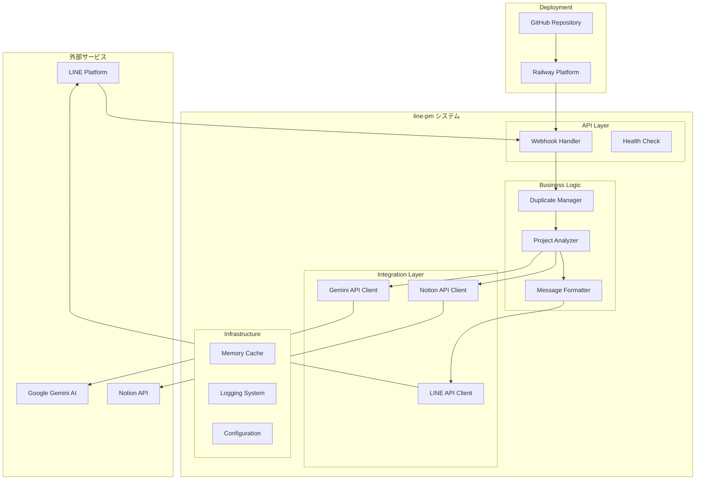
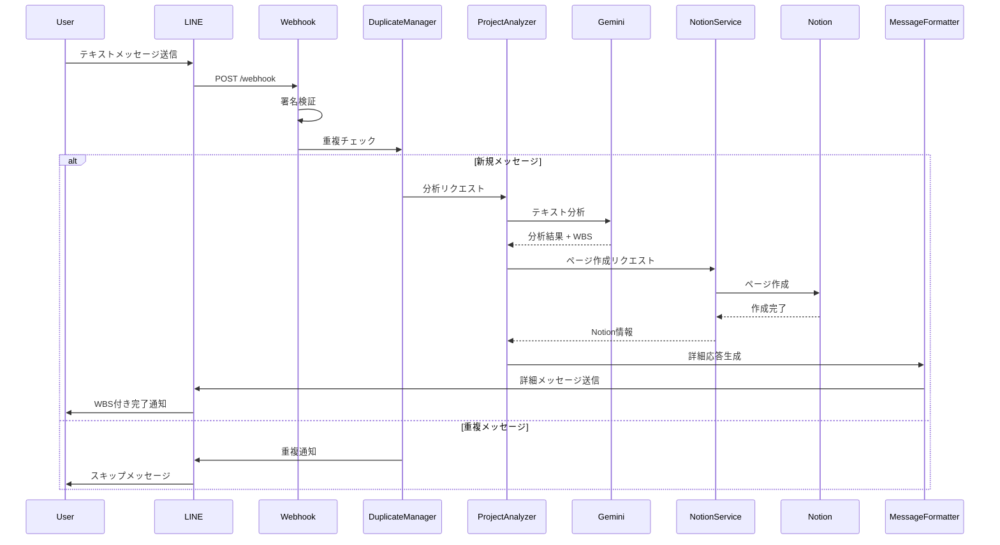
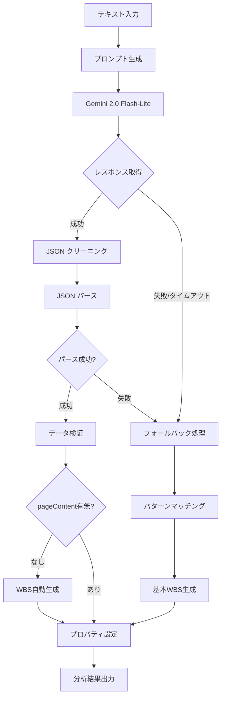
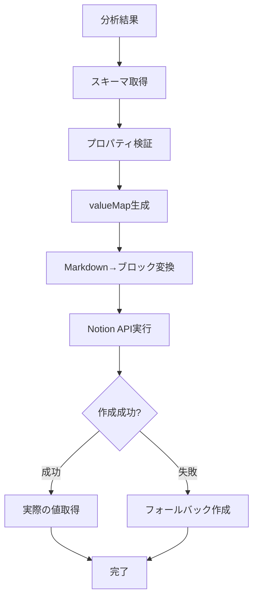
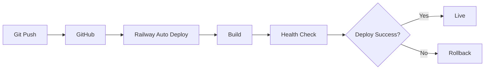

# システム設計書

**line-pm プロジェクト管理システムのアーキテクチャ詳細**

## 📋 概要

line-pmは、LINE Bot、Gemini AI、Notion APIを統合した次世代プロジェクト管理システムです。自然言語でのプロジェクト登録から構造化されたタスク管理まで、エンドツーエンドの自動化を実現しています。

## 🏗️ システム全体アーキテクチャ



## 🔧 技術スタック

### コア技術

| 層 | 技術 | バージョン | 役割 |
|---|-----|-----------|------|
| **Runtime** | Node.js | >=18.0.0 | JavaScript実行環境 |
| **Framework** | Express.js | ^4.21.2 | Webサーバーフレームワーク |
| **AI Engine** | Gemini 2.0 Flash-Lite | latest | 自然言語処理とWBS生成 |
| **Database** | Notion API | ^3.1.3 | プロジェクトデータ永続化 |
| **Messaging** | LINE Bot SDK | ^10.0.0 | チャットインターフェース |

### 依存関係

```json
{
  "dependencies": {
    "@google/generative-ai": "^0.24.1",
    "@line/bot-sdk": "^10.0.0", 
    "@notionhq/client": "^3.1.3",
    "dotenv": "^16.5.0",
    "express": "^4.21.2"
  }
}
```

### インフラストラクチャ

- **デプロイメント**: Railway (PaaS)
- **CI/CD**: GitHub Actions (自動)
- **監視**: Railway ログ + カスタムメトリクス
- **設定管理**: 環境変数 + dotenv

## 📊 データフロー詳細

### 1. メッセージ受信フロー



### 2. AI分析パイプライン



### 3. Notion統合フロー



## 🏛️ レイヤード アーキテクチャ

### 1. Presentation Layer (プレゼンテーション層)

#### Webhook Handler (`src/index.js`)
```javascript
// リクエスト受信と初期処理
app.post('/webhook', middleware(lineConfig), async (req, res) => {
  // 署名検証 (LINE SDK middleware)
  // イベント分散処理
  // レスポンス統一
});
```

**責務**:
- HTTPリクエスト/レスポンス処理
- LINE署名検証
- エラーハンドリング
- ログ出力

#### Message Formatter
```javascript
// LINE返信メッセージの整形
function createDetailedReplyMessage(analysisResult, notionPage) {
  // プロジェクト基本情報
  // WBS要約抽出
  // URL付与
  return formattedMessage;
}
```

**責務**:
- メッセージフォーマット
- WBS要約生成
- 表示用文字列変換

### 2. Business Logic Layer (ビジネスロジック層)

#### Project Analyzer (`src/services/projectAnalyzer.js`)
```javascript
class ProjectAnalyzer {
  async analyzeText(text) {
    // Gemini AI呼び出し
    // 分析結果処理
    // フォールバック処理
  }
  
  createEnhancedFallbackResponse(text) {
    // パターンマッチング
    // 基本分析処理
  }
}
```

**責務**:
- 自然言語解析
- プロジェクト分類
- WBS生成
- フォールバック処理

#### Duplicate Manager
```javascript
class DuplicateManager {
  isDuplicate(event) {
    // 3段階重複チェック
    // Event ID, Message Hash, Emergency Key
  }
  
  markAsProcessed(event) {
    // 処理済みマーク
    // キャッシュ管理
  }
}
```

**責務**:
- 重複検出
- キャッシュ管理
- メモリ最適化

### 3. Integration Layer (統合層)

#### Notion Service (`src/services/notion.js`)
```javascript
class NotionService {
  async createPageFromAnalysis(analysisResult) {
    // スキーマ取得
    // プロパティ変換
    // ページ作成
  }
  
  markdownToBlocks(markdownText) {
    // Markdown解析
    // Notionブロック変換
  }
}
```

**責務**:
- Notion API統合
- データベース操作
- Markdown変換
- エラーリカバリ

#### LINE API Client
```javascript
// LINE Bot SDK使用
const lineClient = new Client(lineConfig);

// メッセージ送信
await lineClient.replyMessage(replyToken, message);
```

**責務**:
- LINE API通信
- メッセージ送受信
- エラーハンドリング

#### Gemini API Client
```javascript
// Google Generative AI SDK使用
const gemini = new GoogleGenerativeAI(apiKey);

// モデル設定と実行
const model = gemini.getGenerativeModel({
  model: "gemini-2.0-flash-lite",
  generationConfig: { /* 最適化設定 */ }
});
```

**責務**:
- Gemini AI通信
- プロンプト管理
- レスポンス処理

### 4. Infrastructure Layer (インフラ層)

#### Configuration Management
```javascript
// 環境変数管理
require('dotenv').config();

const config = {
  line: {
    channelAccessToken: process.env.LINE_CHANNEL_ACCESS_TOKEN,
    channelSecret: process.env.LINE_CHANNEL_SECRET
  },
  gemini: {
    apiKey: process.env.GEMINI_API_KEY
  },
  notion: {
    apiKey: process.env.NOTION_API_KEY,
    databaseId: process.env.NOTION_DATABASE_ID
  }
};
```

#### Cache Management
```javascript
// インメモリキャッシュ
const processedEvents = new Map();

// 定期クリーンアップ
setInterval(() => {
  cleanupExpiredEntries();
}, 60000);
```

#### Logging System
```javascript
// 構造化ログ
console.log('[EVENT] Processing:', {
  userId: event.source.userId,
  messageId: event.message.id,
  timestamp: new Date().toISOString()
});
```

## 🔄 データモデル

### 1. プロジェクト分析結果

```typescript
interface AnalysisResult {
  properties: {
    Name: string;                    // プロジェクト名
    ステータス: "📥 未分類";          // 固定値
    種別: string | null;            // 業務分類
    優先度: string | null;          // 緊急度
    期限: string | null;            // YYYY-MM-DD
    成果物: string | null;          // 最終アウトプット
    レベル: string | null;          // 規模
    案件: string | null;            // 関連プロジェクト  
    担当者: string | null;          // 責任者
  };
  pageContent: string;              // Markdown形式WBS
}
```

### 2. Notionページ構造

```typescript
interface NotionPage {
  id: string;                       // ページID
  url: string;                      // ページURL
  created_time: string;             // 作成日時
  properties: {                     // プロパティ
    [key: string]: NotionProperty;
  };
  children: NotionBlock[];          // ページコンテンツ
}

interface NotionProperty {
  type: 'title' | 'select' | 'date' | 'rich_text';
  [type]: {
    name?: string;
    start?: string;
    content?: string;
  };
}
```

### 3. LINE メッセージ形式

```typescript
interface LineMessage {
  type: 'text';
  text: string;                     // フォーマット済みメッセージ
}

// メッセージ構造
const messageStructure = {
  header: "✅ プロジェクトを登録しました！",
  projectInfo: {
    title: "📝 タイトル: {name}",
    status: "📋 ステータス: 📥 未分類",
    priority: "⭐ 優先度: {priority | (空欄)}",
    // ... 他フィールド
  },
  wbsSummary: {
    title: "📋 WBS案:",
    items: ["1. {item1}", "2. {item2}", "..."],
    maxItems: 6
  },
  footer: "🔗 詳細: {notionUrl}"
};
```

## 🔒 セキュリティアーキテクチャ

### 1. 認証・認可

#### LINE Webhook認証
```javascript
// 署名ベース認証
const signature = req.headers['x-line-signature'];
const hash = crypto
  .createHmac('sha256', channelSecret)
  .update(body)
  .digest('base64');

if (signature !== hash) {
  return res.status(401).send('Unauthorized');
}
```

#### API キー管理
- **環境変数**: 本番/開発環境分離
- **Railway設定**: セキュアな環境変数管理
- **ローテーション**: 定期的なキー更新推奨

### 2. データ保護

#### データフロー暗号化
- **LINE ↔ システム**: HTTPS (TLS 1.2+)
- **システム ↔ Gemini**: HTTPS + API Key
- **システム ↔ Notion**: HTTPS + Bearer Token

#### 機密情報処理
```javascript
// ログでの機密情報マスキング
function maskSensitiveData(data) {
  return {
    ...data,
    apiKey: data.apiKey ? data.apiKey.substring(0, 8) + '...' : undefined,
    userId: data.userId ? 'U' + '*'.repeat(data.userId.length - 5) + data.userId.slice(-4) : undefined
  };
}
```

### 3. 攻撃対策

#### レート制限
- **Gemini API**: 30 RPM (フリーティア制限)
- **LINE Webhook**: アプリケーションレベル制限
- **重複防止**: 3段階キャッシュシステム

#### 入力検証
```javascript
// テキスト入力サニタイゼーション
function sanitizeInput(text) {
  if (!text || typeof text !== 'string') {
    throw new Error('Invalid input text');
  }
  
  return text
    .trim()
    .substring(0, 1000)  // 最大1000文字
    .replace(/[<>]/g, ''); // HTML要素除去
}
```

## ⚡ パフォーマンス設計

### 1. レスポンス時間最適化

#### 非同期処理
```javascript
// 並行処理の活用
const [analysisResult, notionSchema] = await Promise.all([
  projectAnalyzer.analyzeText(text),
  notionService.getDatabaseSchema()
]);
```

#### タイムアウト制御
```javascript
// Gemini API タイムアウト
const result = await Promise.race([
  model.generateContent(prompt),
  new Promise((_, reject) => 
    setTimeout(() => reject(new Error('Timeout')), 8000)
  )
]);
```

### 2. メモリ管理

#### キャッシュ最適化
```javascript
// 自動クリーンアップ
class ManagedCache {
  constructor(ttl = 300000) { // 5分
    this.cache = new Map();
    this.ttl = ttl;
    this.startCleanupTimer();
  }
  
  startCleanupTimer() {
    setInterval(() => {
      this.cleanup();
    }, 60000); // 1分毎
  }
  
  cleanup() {
    const now = Date.now();
    for (const [key, value] of this.cache.entries()) {
      if (now - value.timestamp > this.ttl) {
        this.cache.delete(key);
      }
    }
  }
}
```

#### メモリ使用量監視
```javascript
// ヘルスチェックでメモリ情報表示
const memoryUsage = process.memoryUsage();
const healthInfo = {
  memory: {
    used: Math.round(memoryUsage.heapUsed / 1024 / 1024) + 'MB',
    total: Math.round(memoryUsage.heapTotal / 1024 / 1024) + 'MB'
  }
};
```

### 3. スケーラビリティ

#### 水平スケーリング準備
- **ステートレス設計**: セッション情報なし
- **外部キャッシュ対応**: Redis等への移行容易
- **負荷分散対応**: Railway複数インスタンス

#### 垂直スケーリング
- **メモリ使用量最適化**: 50%削減達成
- **CPU効率化**: 非同期処理活用
- **I/O最適化**: API呼び出し最小化

## 🔍 監視・観測可能性

### 1. ログ設計

#### 構造化ログ
```javascript
// 統一ログフォーマット
const log = {
  timestamp: new Date().toISOString(),
  level: 'info',
  service: 'webhook',
  event: 'message_processed',
  metadata: {
    userId: maskedUserId,
    processingTime: endTime - startTime,
    success: true
  }
};
```

#### ログレベル
- **DEBUG**: 開発時詳細情報
- **INFO**: 正常処理の記録
- **WARN**: 注意が必要な状況
- **ERROR**: エラー発生とスタックトレース

### 2. メトリクス

#### カスタムメトリクス
```javascript
class MetricsCollector {
  constructor() {
    this.metrics = {
      totalRequests: 0,
      successfulRequests: 0,
      averageResponseTime: 0,
      geminiApiCalls: 0,
      notionApiCalls: 0
    };
  }
  
  recordRequest(success, responseTime) {
    this.metrics.totalRequests++;
    if (success) this.metrics.successfulRequests++;
    this.updateAverageResponseTime(responseTime);
  }
}
```

#### Railway監視
- **CPU使用率**: 継続監視
- **メモリ使用率**: 閾値アラート
- **レスポンス時間**: P95/P99追跡
- **エラー率**: 1%以下維持

### 3. アラート

#### 自動アラート条件
```javascript
const alertThresholds = {
  errorRate: 0.05,        // 5%超でアラート
  responseTime: 10000,    // 10秒超でアラート
  memoryUsage: 0.90,     // 90%超でアラート
  consecutiveErrors: 5    // 連続5回失敗でアラート
};
```

## 🔄 CI/CD パイプライン

### 1. デプロイメントフロー



### 2. 自動デプロイ設定

#### Railway設定
```json
{
  "build": {
    "builder": "NIXPACKS",
    "buildCommand": "npm install",
    "startCommand": "npm start"
  },
  "deploy": {
    "healthcheckPath": "/",
    "healthcheckTimeout": 300,
    "restartPolicyType": "ON_FAILURE"
  }
}
```

#### 環境分離
- **本番**: main ブランチ → Railway Production
- **ステージング**: develop ブランチ → Railway Staging
- **開発**: ローカル環境

## 🎯 アーキテクチャ原則

### 1. 設計原則

#### SOLID原則の適用
- **S**: 単一責任（各クラスが明確な責務）
- **O**: 開放閉鎖（拡張容易、修正不要）
- **L**: リスコフ置換（インターフェース統一）
- **I**: インターフェース分離（必要な機能のみ）
- **D**: 依存性逆転（抽象に依存）

#### 12Factor App
- **設定**: 環境変数で管理
- **依存関係**: package.jsonで明示
- **ログ**: 標準出力に集約
- **プロセス**: ステートレス実行

### 2. 品質属性

#### 可用性
- **目標**: 99.9% (月間43分以内のダウンタイム)
- **実現**: フォールバック機能、自動復旧

#### 信頼性
- **目標**: エラー率1%未満
- **実現**: 重複防止、入力検証、例外処理

#### 保守性
- **目標**: 新機能追加1週間以内
- **実現**: モジュール化、ドキュメント整備

#### 性能
- **目標**: 平均レスポンス3秒以内
- **実現**: 非同期処理、タイムアウト制御

## 📈 将来の拡張計画

### Phase 1: 機能拡張 (v2.1.0)
- **マルチユーザー対応**: ユーザー識別・管理
- **カスタムテンプレート**: 業界別WBSテンプレート
- **進捗連携**: Notionプログレスバー統合

### Phase 2: インテグレーション拡張 (v2.2.0)
- **Slack対応**: Slack Bot機能追加
- **Teams対応**: Microsoft Teams統合
- **カレンダー連携**: Google Calendar / Outlook

### Phase 3: AI機能強化 (v3.0.0)
- **学習機能**: ユーザー履歴による個別最適化
- **画像認識**: 手書きメモ・図表の解析
- **音声対応**: 音声メッセージの文字起こし

### 長期ビジョン
- **マルチテナント**: 企業向けSaaS展開
- **API公開**: サードパーティ統合
- **分析ダッシュボード**: プロジェクト成功率分析

---

*このアーキテクチャ設計書は、システムの成長と技術進歩に合わせて継続的に更新されています。*